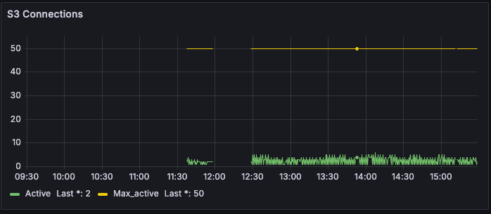

## tomcat_threads_exporter 安装（在所有Artifactory节点上）
安装 python3 (如已安装请跳过):
```bash
yum install -y python3 python3-pip
```
安装 s3_connection_metrics.py 需要的模块:
```bash
pip3 install prometheus_client
```
开启 Artifactory S3 connection debug 日志, 修改 $ARTIFACTORY_HOME/var/etc/artifactory/logback.xml, 在倒数第二行添加以下部分(最后一行 </configuration> 上面一行),无需重启 Artifactory:
```xml
<appender name="connectionpool" class="ch.qos.logback.core.rolling.RollingFileAppender">
  <File>${log.dir}/artifactory-connectionpool.log</File>
  <rollingPolicy class="org.jfrog.common.logging.logback.rolling.FixedWindowWithDateRollingPolicy">
    <FileNamePattern>${log.dir.archived}/artifactory-connectionpool.%i.log.gz</FileNamePattern>
    <maxIndex>10</maxIndex>
  </rollingPolicy>
  <triggeringPolicy class="ch.qos.logback.core.rolling.SizeBasedTriggeringPolicy">
    <MaxFileSize>25MB</MaxFileSize>
  </triggeringPolicy>
  <encoder class="ch.qos.logback.core.encoder.LayoutWrappingEncoder">
    <layout class="org.jfrog.common.logging.logback.layout.BackTracePatternLayout">
      <pattern>%date{yyyy-MM-ddTHH:mm:ss.SSS, UTC}Z [jfrt ] [%-5p] [%-16X{uber-trace-id}] [%-30.30(%c{3}:%L)] [%-20.20thread] - %m%n</pattern>
    </layout>
  </encoder>
</appender>
<logger name="org.apache.http.impl.conn.PoolingHttpClientConnectionManager" additivity="false">
  <level value="Debug"/>
  <appender-ref ref="connectionpool"/>
</logger>
```
下载 s3_connection_metrics.py 脚本至本地目录, 如:
```
mkdir /opt/jf_monitoring_node/ && cd /opt/jf_monitoring_node/
```
根据实际路径修改 s3_connection_metrics.py 以下日志路径部分:
```python
LOG_FILE_PATH = '/var/opt/jfrog/artifactory/log/artifactory-connectionpool.log'
```
运行:
```bash
nohup python3 s3_connection_exporter.py &
```
查看是否展示数据:
```bash
curl http://localhost:8001/metrics
```
### Prometheus 配置添加(Prometheus 节点):
编辑 prometheus.yml:
```bash
vim /opt/jf_monitoring/MonitoringTools/jf_monitoring/prometheus/config/prometheus.yml
```
添加以下配置(示例 192.168.139.212 为运行脚本的 Artifactory 节点 ip):
```bash
scrape_configs:
  - job_name: 'artifactory_s3_connections'
    static_configs:
      - targets: ['192.168.139.212:8001']
    scrape_interval: 5s
```
重启 Prometheus:
```bash
docker restart prometheus
```

### 上传 dashboard:
**Dashboards** | **New dashboard**, 上传 "Artifactory Dashboard-latest.json":
